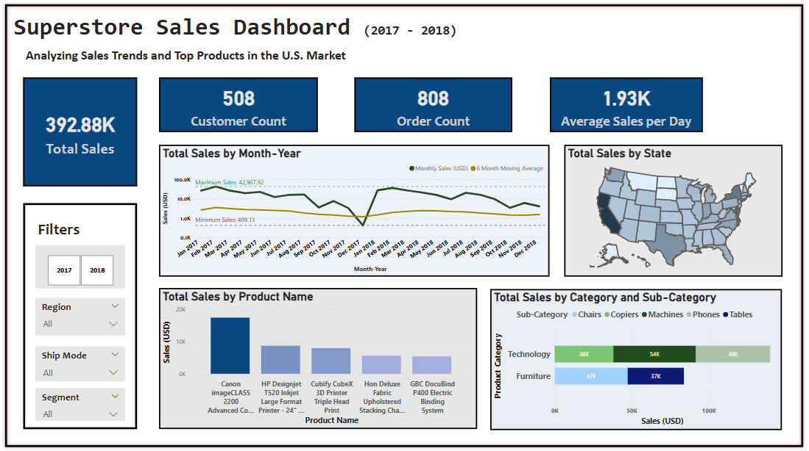

# 🛒 Superstore Sales Analytics Project (Python + Power BI)

This project presents a comprehensive sales analytics dashboard built using the **Superstore Sales Dataset** from Kaggle. It combines **Python** for data cleaning and transformation with **Power BI** for dynamic, interactive data visualization. The goal is to uncover actionable business insights across regions, customer segments, and product categories.

---

## 📊 Project Overview

- **Dataset**: [Superstore Sales Forecasting Dataset – Kaggle](https://www.kaggle.com/datasets/rohitsahoo/sales-forecasting/data)
- **Tools Used**: Python (pandas), Power BI
- **Focus Areas**: Sales trends, regional performance, top products, and customer segmentation
- **Key Deliverables**:
  - Cleaned and structured dataset using Python
  - Interactive dashboard in Power BI
  - Insights summary and business recommendations
  - Documented DAX measures used in dashboard calculations

---

## 🧹 Data Cleaning (Python)

Raw data was cleaned using `pandas`. Key steps included:

- Converted `Order Date` and `Ship Date` to datetime format
- Removed rows with missing or corrupt dates and postal codes
- Dropped redundant columns like `Row ID`, `Country`, and `Customer Name`
- Created `Year`, `Month`, and `Month-Year` fields for trend analysis

📄 [View the Python Script → `superstorepython.py`](./superstorepython.py)

---

## 📈 Dashboard Highlights (Power BI)

### KPI Cards:
- 📦 **Total Sales**: $392.88K  
- 👥 **Unique Customers**: 508  
- 🧾 **Total Orders**: 808  
- 📅 **Average Sales per Day**: $1.93K  

### Interactive Visuals:
- **Monthly Sales Trend** with 6-month moving average
- **Sales by U.S. State** (Map)
- **Top Products and Sub-Categories**
- **Category vs Sub-Category Breakdown**
- **Dynamic filters**: Year, Segment, Region, Ship Mode

📄 [Download Power BI File → `DashboardSuperStore.pbix`](./DashboardSuperStore.pbix)

---

## 📌 Key Insights

- **Phones** and **Chairs** are the top-performing sub-categories
- **Technology** category generates the highest revenue
- **California** and **New York** lead in total sales
- **Sales peak in **February 2017**, with a dip in **December 2017**
- **Consumer** and **Corporate** segments drive most of the revenue

📄 [View the full Insights Summary](./InsightsSummary_SuperStore.md)

---

## 🧮 DAX Measures

This project used several DAX measures to calculate KPIs, moving averages, and trends in Power BI.

📄 [View all DAX measures used → `DAX_Measures.md`](./DAX_Measures.md)

---

## 📎 File Structure

| File | Description |
|------|-------------|
| `superstorepython.py` | Python script for data cleaning |
| `DashboardSuperStore.pbix` | Power BI dashboard file |
| `dashboardpng.png` | Image preview of the dashboard |
| `InsightsSummary_SuperStore.md` | Key insights and business recommendations |
| `DAX_Measures.md` | DAX formulas used in Power BI calculations |
| `README.md` | Project summary |

---

## 🧠 Skills Demonstrated

- Data cleaning and wrangling with Python (`pandas`)
- Time-based feature engineering
- Visual storytelling and business intelligence using Power BI
- Dashboard design with interactivity and slicers
- Writing DAX measures for KPI and trend analysis
- Drawing strategic business insights from data

---

## 📬 Contact

Feel free to reach out:
- 📧 Email: afrinshibu29@gmail.com
- 💼 LinkedIn:(https://www.linkedin.com/in/afrin-shibu-mubarak/)  
---

> ⭐ If you found this project helpful or inspiring, please consider starring the repo!

